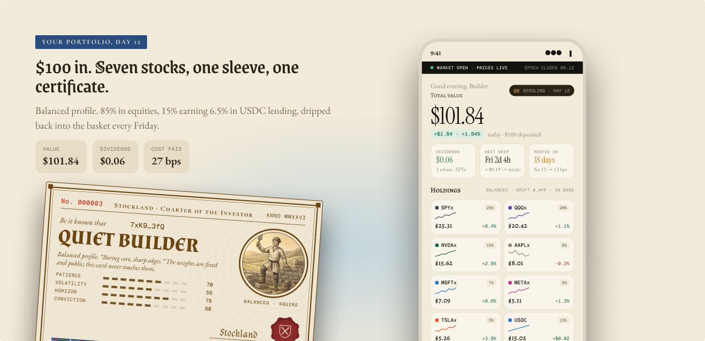
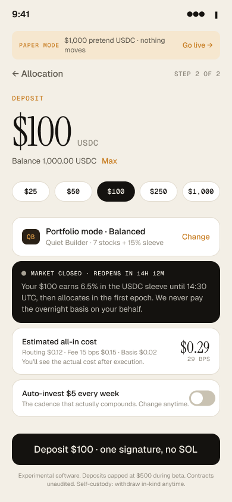

# Stockland API

**Answer five questions. Deposit USDC. Own a real stock portfolio that matches how you actually invest.**

Stockland turns a USDC deposit into a deterministic, risk-matched basket of tokenized equities (xStocks) on Solana. Allocation is a pure function of the risk profile: no randomness, no trading, no charts. The consumer hook is the *Charter of the Investor*, a soulbound NFT that records who you are as an investor and evolves with tenure.

This repository is the backend: sponsored fee payer, live cost quotes, the epoch crank that executes netted swaps, and a Postgres record of fills so every receipt shows *estimated versus actual* cost. The on-chain program (Rust / Anchor) and the site live in [stockland-front](https://github.com/cossmikus/stockland-front).

Built for the Solana RWA track, from Kazakhstan.

## What it looks like

| Landing | Your portfolio after a $100 deposit |
| --- | --- |
|  |  |

Six charters, one ink each, engraved vignettes, wax seal that changes from Squire to Laird as tenure grows:


| The quiz shows its working | Deposit with an honest cost preview |
| --- | --- |
|  |  |

## How money moves

```
user ──sign──▶ /v1/tx/deposit ──▶ /v1/tx/submit (sponsor co-signs the fee) ──▶ Solana program vault
                                                                                      │
every 15 min inside 14:30–21:00 UTC ──▶ crank: close epoch ▶ one Jupiter swap per asset ▶ settle pro-rata shares ▶ open next
                                                                                      │
user ──sign──▶ /v1/tx/withdraw-in-kind ──▶ the actual tokens land in the user's wallet (no swap, no spread)
```

- Money lives on-chain in vaults owned by the program. This service never holds user funds; its two keys only pay fees and turn the crank.
- Positions are pro-rata shares of per-mint vaults, so issuer rebases (dividends, splits) flow through automatically.
- The crank only ever invokes the allow-listed Jupiter program, signed by the vault PDA, and refuses a swap that spends more than the epoch owes.
- Cost is shown twice: a live per-leg Jupiter estimate before you sign, the realized figure after execution.

## Layout

```
src/domain     pure logic: allocation weights, cost model, guards, share math mirrored from lib.rs (unit-tested)
src/solana     adapters: RPC, keys, PDAs, Anchor client, Jupiter, Token-2022 reader, sponsor validation
src/services   use cases: quote, deposit, withdraw, sponsor, crank, positions, universe
src/db         Drizzle schema + repo (optional; the API works without DATABASE_URL)
src/api        Fastify routes, thin
src/workers    one-shot crank entry for external cron
scripts        day-one Token-2022 check, depth test, key setup, one-time program init
```

## Run it

```bash
cp .env.example .env         # paste HELIUS_API_KEY, set SOLANA_CLUSTER (devnet for rehearsal, mainnet-beta for real money)
npm install && npm test
./scripts/setup-keys.sh      # creates keys/ (deploy, crank, sponsor), fills the two secrets into .env, prints addresses to fund
```

Program (in stockland-front): `anchor keys list` → put the id into `Anchor.toml`, `lib.rs`, and this repo's `.env` `PROGRAM_ID`; `anchor build && anchor deploy`; copy `target/idl/stockland.json` to `idl/`.

```bash
npm run check:token2022 <wallet>   # mainnet only: Token-2022 extensions + simulated transfers to/from the vault PDA
npm run check:depth                # mainnet only: Jupiter quotes at $100/$1k/$10k → depth/universe.json (locked list)
npm run init:program               # config, three profiles, one vault per mint, epoch 1
npm run dev                        # API on :8787; CRANK_ENABLED=true runs the crank in-process
```

## Endpoints

| Route | Purpose |
| --- | --- |
| `GET /health` | market state, sponsor address, locked universe |
| `GET /v1/quote?amount=50&profile=Balanced` | A3 cost preview from real Jupiter legs |
| `POST /v1/tx/deposit` | unsigned deposit transaction, sponsor as fee payer |
| `POST /v1/tx/withdraw-in-kind` | A4: one transfer per asset plus the USDC sleeve |
| `POST /v1/tx/request-sell` | queue a netted sale into the open epoch |
| `POST /v1/tx/submit` | validate, co-sign the fee, send, record |
| `GET /v1/positions/:owner` | decoded holdings, tier, receipts |
| `GET /v1/epochs/current` | status and fills of the open epoch |
| `POST /v1/admin/crank` | manual epoch turn (Bearer token) |

## Status

Sprint 2, "real money moves". Domain tests pass. Devnet rehearsal in progress: deploy key funded, program build next. Mainnet round trip of $50 follows the depth test. Kamino sleeve, rebalancing and the dividend ledger are Sprint 3.

Experimental software, not financial advice. Tokenized stocks give economic exposure only. Contracts are unaudited; deposits are capped during beta.
